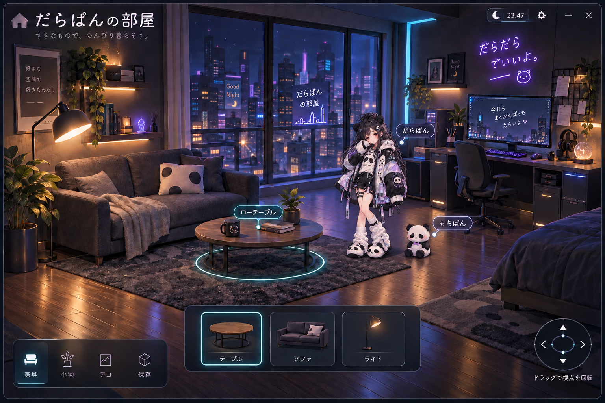

# 素材

サイバーパンダの「だらぱん」は、ユーザーがこの制作に使用すると指定した画像です。

- `darapan-chibi.png`: 3頭身版。元画像を変更せずにコピー。
- `darapan-classic.png`: 元の立ち姿。元画像を変更せずにコピー。

## 保存した制作資料と生成素材

| ファイル                                                                   | 内容・出典                                                                 | 状態                                           |
| -------------------------------------------------------------------------- | -------------------------------------------------------------------------- | ---------------------------------------------- |
| [references/darapan-design-sheet.png](references/darapan-design-sheet.png) | ユーザー提供の「だらぱん デザインルール 改訂版」。元ファイルを変更せず保存 | 外見の基準。右下のパンダをもちぱんの参考にする |
| [concepts/darapan-mochipan-room.png](concepts/darapan-mochipan-room.png)   | この会話で生成し採用した、小さめの2キャラがいる部屋イメージ                | 設計参考。実装画面や背景だけの完成素材ではない |
| [characters/darapan-cyber.png](characters/darapan-cyber.png)               | 提供シートを参考に生成した全身のだらぱん                                   | 3D版に登録済み。1024×1536                      |
| [characters/mochipan.png](characters/mochipan.png)                         | 提供シートのパンダを参考に生成したもちぱん                                 | 3D版に登録済み。1312×1199                      |

生成方針は、だらぱんの黒髪・パンダ耳・白黒のサイバージャケットと淡い紫/水色のアクセント、もちぱんの丸い姿と紫のリボンを維持することです。画像生成はこの会話のOpenAI画像生成機能を使いました。生成後のPNGを変更せず保存しています。

2体のPNGには実際のアルファチャンネルと完全透明な画素があります。だらぱんの最大アルファ値は254で、完全不透明な画素はありません。縁の半透明部分を含め、3Dの夜の部屋と昼の照明で表示を確認しています。

寸法・アルファ範囲・SHA256は[manifest.json](manifest.json)に記録しています。このmanifestは資料の記録で、アプリの素材カタログとは別です。2つのキャラPNGを3D版の画面に登録しました。部屋イメージとデザインシートは参考資料で、画面には含めません。

キャラの表示サイズは画像ファイルの縮小ではなく、実装側の配置スケールで調整します。採用イメージでは、初回の2キャラ案に対して縦横とも約半分の大きさが希望されています。

このrepoが公開されていることは、画像の転載・再配布・商用利用を許可する意味ではありません。素材の利用条件についてはrepoの管理者へ確認してください。

新しい画像はこのディレクトリへ置き、`src/shared/catalog.ts`で登録します。登録した画像だけがビルドに含まれます。対応形式はPNG、JPEG、WebP。ファイル名は英数字・ハイフン・アンダースコアにしてください。

## 3D素材

`models/`に、Blender MCPでこの制作のために生成した`room.glb`・`table.glb`・`sofa.glb`・`lamp.glb`・`plant.glb`と、編集用の`darapan-room.blend`を保存しています。ツクヨミの素材や第三者の素材集は使っていません。生成コードは`scripts/build-room-models.py`です。

GLBは形状と単色・発光マテリアルを含み、外部テクスチャへの参照はありません。`.blend`は生成GLBだけを新しいBlenderプロセスへ読み込んで保存し、制作中の別シーンを含めないようにしています。各モデルは別コレクションにあり、家具コレクションは初期状態では非表示です。

登録する画像はサブディレクトリ内のパスにも対応します。生成素材の再ビルド方法と座標の向きは[3D版の実装解説](../docs/3d-room.md)を参照してください。
