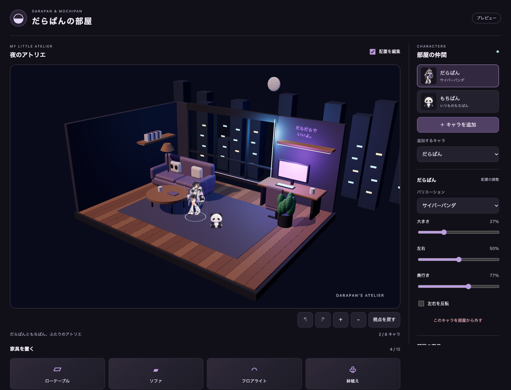
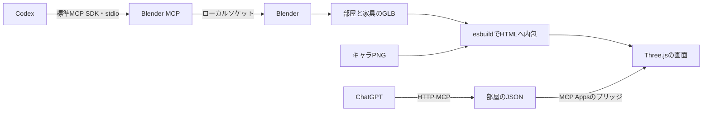

# 3Dの部屋をどう実現したか

部屋と家具は3D、だらぱん・もちぱんは透過PNGです。PNGをカメラに正面を向くSpriteとして置くので、外見を保ったまま3D空間で配置できます。キャラの背面・立体モデル・表情・動きは生成していません。



## 制作と実行を分ける



Blender MCPは作るときだけ使います。利用者が部屋を開くときは、制作済みGLBをThree.jsで描画します。NodeサーバーやChatGPTの利用者にBlenderは必要ありません。

制作コードは`scripts/build-room-models.py`です。床板・壁・窓・街並み・机と、4種類の家具を、形状と単色/発光マテリアルで作りました。生成した画像の部屋は構図と色の参考で、完成背景として貼り付けていません。今回のモデルは軽い形状を使った初版で、参考画像の写真のような材質までは再現していません。

再制作する場合:

```sh
npm run dev:blender
# 別のターミナルで
npm run build:models
npm run build
```

`build:models`はMCP経由でコードを実行し、`assets/models/`の5つのGLBを上書きします。制作中の別シーンを保持するため、専用シーンで制作して元のシーンへ戻します。編集用`.blend`は別のBlenderプロセスで生成GLBだけを読み込んで保存します。手作業で編集したGLBや`.blend`は、再制作前に別名で保存してください。

## 3Dの描画

`src/web/room-view.ts`がThree.jsを担当します。

- `WebGLRenderer`: ブラウザのGPUで描画。ピクセル比を最大2に制限。
- `GLTFLoader`: 内包したGLBのバイナリを`parseAsync`で読み込み。
- `Sprite`: 透過PNGのキャラ。画像の縦横比とアルファを維持。
- `OrbitControls`: 空いている場所のドラッグで視点を回転。ボタンで回転・ズーム・リセットも可能。
- `Raycaster`: クリックした家具と、カーソルが床に当たる位置を求める。

ずっとアニメーションループを回すのではなく、配置・視点・読み込み・サイズが変わったときだけ描画します。見えていないタブでは描画を止め、復帰時に再描画します。WebGLが使えない場合は、キャラだけの平面プレビューへ切り替えます。そこで家具の3D表示や視点操作は使えませんが、配置データの操作は残ります。

外部ファイルを取得せずに動かすため、GLBとPNGをJavaScript内へ埋め込み、1つのUIリソースにしています。GLBには外部テクスチャがなく、解析時にも別URLへのリクエストはありません。現時点のHTMLは約8.5MiBです。将来素材が増える場合は配信とCSPを見直します。

## 床の座標と画面の座標

保存データはカメラの位置に依存しません。

| 項目             | 意味                                                 |
| ---------------- | ---------------------------------------------------- |
| `x`              | 床の左右10〜90。50が中央                             |
| `y`              | 床の奥行き45〜96。45が窓側、96が手前                 |
| キャラの`size`   | 基準高さ5mの何%か。だらぱん27=1.35m、もちぱん14=0.7m |
| 家具の`rotation` | 床の上で0〜359度回転                                 |
| 家具の`scale`    | 元モデルに対する0.6〜1.6倍                           |

`src/shared/room-layout.ts`が、保存用の割合と3D座標を変換します。Three.jsではYが高さで、床はXZ平面です。BlenderではZが高さですが、glTFエクスポーターが座標系を変換します。

ドラッグすると、カメラから床へ伸びる光線をRaycasterで求め、その交点の移動量を保存座標へ戻します。そのため、視点を回した後も床に沿って動きます。カメラ操作そのものは配置JSONを変更しません。

キャラの上には、投影した位置と大きさに合う透明なHTMLボタンを置きます。Three.jsの描画だけに操作を閉じ込めず、キーボードや支援技術でもキャラを選べるようにしています。家具もHTMLの一覧から選び、矢印キーとスライダーで操作できます。

## MCPと状態の確定

MCPツールは引き続き4つです。`room_catalog`がキャラ・家具・背景のIDを返し、`room_update`が全配置を保存します。

`scene.version`は2になり、`placements`（キャラ）と`furniture`（家具）を持ちます。画面・モデルのどちらも、最新の`revision`を使って変更します。ドラッグ中は画面だけを更新し、指を離したときに1回保存します。途中で会話側から更新された場合は古いドラッグ結果を適用しません。

旧版の保存JSONは画面から読み込めます。キャラを約半分のサイズにし、家具なしのversion 2へ移行します。新しいMCP入力はversion 2なので、ChatGPTではプラグインをRefreshして新しい会話で確認してください。UIの識別子も`ui://character-room/room-v2.html`へ更新しました。

## 確認した範囲

- 型検査、ビルド、状態・MCP・GLB・旧版JSONの14件のテスト。
- 実ブラウザでキャラと家具のドラッグ、矢印キー、左右反転、家具の回転と追加削除、背景切り替え、JSON保存読み込み。
- 公式SDKのローカルAppBridgeで、ホストからの変更→画面と、画面の変更→MCP→モデルコンテキストを確認。
- デスクトップと狭い画面での表示、WebGLがない環境での平面プレビュー。

ChatGPT実ホストのパネル・サイドバー・実環境のCSPは、[接続手順](chatgpt-setup.md)で別途確認します。ローカルブリッジはChatGPT自体ではありません。

公式資料: [GLTFLoader](https://threejs.org/docs/pages/GLTFLoader.html)、[Sprite](https://threejs.org/docs/pages/Sprite.html)、[OrbitControls](https://threejs.org/docs/pages/OrbitControls.html)、[Raycaster](https://threejs.org/docs/pages/Raycaster.html)。
