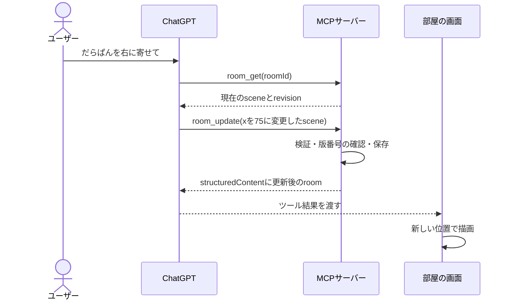

# だらぱんの部屋はどう動くか

部屋と家具はBlenderで作ったGLBをThree.jsで描画し、キャラは透過PNGのSpriteとして重ねます。画像そのものを毎回生成するのではなく、部屋のJSONから位置・大きさ・素材を変更します。詳しくは[3D描画の実装解説](3d-room.md)。

## 1. 画面の配置はJSON

実際の部屋には、次のような状態があります。UUIDは例です。

```json
{
  "roomId": "21a6f2b7-e712-49e8-8024-d7cb91007491",
  "revision": 0,
  "scene": {
    "version": 2,
    "backgroundId": "night",
    "placements": [
      {
        "id": "e027c0a1-892d-4b7d-94e0-7acb2b8cd9d0",
        "characterId": "darapan",
        "variantId": "cyber",
        "x": 50,
        "y": 77,
        "size": 27,
        "flipped": false
      }
    ],
    "furniture": [
      {
        "id": "68aefed3-b9b3-4ddf-9b3d-93168cb1bf3c",
        "furnitureId": "table",
        "x": 33,
        "y": 77,
        "rotation": 0,
        "scale": 1
      }
    ]
  }
}
```

`characterId`はキャラ、`variantId`はそのキャラの画像を指定します。だらぱんを2体置いた場合、同じ`characterId`を使い、配置ごとの`id`を別にします。

`x`は床の左右10〜90、`y`は窓側45〜手前96です。画面上のピクセル座標ではないので、視点を回しても場所は変わりません。`size`は基準高さ5mに対する画像の高さの割合で、初期値はだらぱん27、もちぱん14です。家具は`rotation`（0〜359度）と`scale`（0.6〜1.6倍）を持ちます。

`scene.version: 2`はキャラと家具を保存します。画面から旧版`version: 1`のJSONを読み込む場合は、キャラの大きさを半分にし、家具なしのversion 2へ変換します。MCPの更新入力はversion 2です。

`version`は保存ファイルの形式の版、`revision`はその部屋が何回更新されたかです。用途が違います。

## 2. MCPはモデルと機能をつなぐ約束

MCP（Model Context Protocol）は、AIクライアントが外部の機能を発見して呼ぶための通信規約です。今回の構成ではChatGPTがクライアント、Node.jsのプログラムがサーバーです。MCPサーバー自体が会話AIになるわけではありません。

| MCPの要素 | このアプリでの役割                                 |
| --------- | -------------------------------------------------- |
| Tools     | 部屋を開く・読む・変更する・素材を調べる           |
| Resources | `ui://character-room/room-v2.html`という画面のHTML |
| Prompts   | 今回は使わない。再利用するプロンプトを公開する機能 |

`ui://...`はMCPのリソース識別子です。通常のWebページURLではないため、ブラウザのアドレス欄に入力して開くものではありません。

サーバーは`tools/list`に、ツール名・説明・入力スキーマを返します。モデルはそれを読み、ユーザーの依頼に合うツールを選びます。Zodで書いた入力スキーマは、公開するJSON Schemaと実行時の入力検証に使われます。

ツールは4つです。

| ツール         | 入力                                      | 結果                     |
| -------------- | ----------------------------------------- | ------------------------ |
| `room_open`    | 省略可能な`roomId`                        | 新規または既存の部屋とUI |
| `room_get`     | `roomId`                                  | 最新の部屋               |
| `room_update`  | `roomId`、`baseRevision`、変更後の`scene` | 更新後の部屋とUI         |
| `room_catalog` | 空オブジェクト                            | 登録済みの素材一覧       |

「だらぱんを右に寄せて」の流れは次のとおりです。



MCPのリクエスト自体はJSON-RPCです。例えば:

```json
{
  "jsonrpc": "2.0",
  "id": 7,
  "method": "tools/call",
  "params": {
    "name": "room_get",
    "arguments": { "roomId": "21a6f2b7-e712-49e8-8024-d7cb91007491" }
  }
}
```

このJSON-RPCの`id`はリクエストと返答を対応させる番号です。部屋の`roomId`とは別です。実装ではSDKがJSON-RPCを処理するため、文字列を手で組み立てる必要はありません。

## 3. HTTPの接続と、部屋の状態は別

`src/server/index.ts`はStreamable HTTPの`/mcp`を提供します。今回のHTTPトランスポートはstatelessで、リクエストごとにMCPサーバーとトランスポートを作って閉じます。一方、`RoomStore`はプロセス内で共有し、`roomId`ごとの配置を保持します。

つまり「HTTPの接続を切る」ことと「部屋を消す」ことは同じではありません。HTTPセッションに部屋を結び付けないため、後のツール呼び出しにも`roomId`を明示的に渡します。UUIDは部屋を分ける識別子であり、ユーザー認証の代わりにはなりません。

SDKの対応するプロトコルで初期化・ツール検出・実行を行います。このrepoはMCP 2.0の新方式への移行を独自に実装していません。まずSDKが提供するStreamable HTTPとして実際に通信を検証しています。

## 4. MCP Appsは画面とホストの通信

ChatGPT内では、部屋のHTMLがiframeに表示されます。そこでの`window.parent`はChatGPT側です。画面はSDKの`App`を使い、`postMessage`を介したJSON-RPCブリッジでホストと通信します。

| SDKの処理                  | 目的                                               |
| -------------------------- | -------------------------------------------------- |
| `app.connect()`            | ホストと接続し、対応する機能を確認                 |
| `app.ontoolresult`         | ChatGPTが渡すツール結果を受け取る                  |
| `app.callServerTool()`     | 画面からMCPツールを呼ぶ                            |
| `app.updateModelContext()` | 現在の配置を次の会話でモデルが参照できるようにする |

ドラッグ中は画面だけを一時的に動かし、指を離したときに`room_update`を1回呼びます。サーバーが返した配置が確定した状態です。マウスの移動ごとにサーバーを呼ぶと、呼び出し回数と待ち時間が増えるので避けています。

`updateModelContext`は会話を勝手に送信しません。ユーザーの次の発言に備えて、現在の部屋の情報を共有します。画像やGLB全部ではなく、素材ID・座標・回転・倍率・版番号を渡します。

ChatGPT向けの`OpenAIExtensions`も初期化し、ホストから現在のモデルコンテキストが変わった通知を受けられる場合は反映します。対応しないホストもあるので、基本操作は標準ブリッジを使います。

## 5. Plugin Extensionsは入口を追加

`room_open`のメタデータに次を登録しています。

```ts
_meta: {
  ui: { resourceUri: UI_URI },
  "openai/ui": {
    entrypoints: [{ type: "thread" }, { type: "global" }]
  }
}
```

`ui.resourceUri`はツールと画面を関連付けるMCP Appsの設定。`openai/ui.entrypoints`はChatGPT向けの追加設定で、`thread`が会話横、`global`がサイドバーの入口です。両者は別の責任を持ちます。入口から開く場合は空の引数`{}`が渡されるので、`room_open`は引数を省略して呼べるようにしています。

初版は、モデルから配置を変更したときもUIを表示できるように`room_update`にも画面を関連付けます。画面内部からの更新は`callServerTool`の返答を使ってその画面を描き直します。将来、より多くのデータ処理をする場合は、データ操作ツールと画面表示ツールを分離して再表示を減らせます。

## 6. 状態が食い違うとき

例えば、画面で`revision: 4`の部屋を`5`へ更新した後、ChatGPTが古い`4`を使って変更すると、サーバーは`CONFLICT`を返します。古い配置で上書きしません。画面は最新状態を取得して再操作を案内し、モデルには`room_get`で読み直すよう伝えます。

保存JSONには`scene`だけを書き出します。部屋IDは保存ファイルに入れません。読み込んだ配置を今の部屋へ適用するので、別の部屋やサーバー再起動後にも復元できます。

## 7. ローカルプレビューとの違い

単独のブラウザで開いた場合は、ChatGPTのホストブリッジがありません。開発用の`/api/tools/:name`を使い、同じ`callRoomTool`を呼びます。これで画面を先に開発できます。

ChatGPT内のiframeでは開発用APIを使わず、MCP Appsブリッジを使います。`NODE_ENV=production`ではプレビューと開発用APIを公開しません。

テストはメモリ内のMCP接続と実際のHTTP接続を確認します。ChatGPTアカウント側のDeveloper mode、Extensionsの提供状況、実際のパネル表示は、接続後に別途確かめる必要があります。

### ブリッジをローカルで見る

`npm run dev`のサーバーを動かしたまま、別のターミナルで`npm run preview:bridge`を実行し、`http://127.0.0.1:3001`を開きます。

このテスト用ホストは公式SDKの`AppBridge`を使い、iframeからの呼び出しを実際のHTTP MCPサーバーへ転送します。「模擬モデル：右へ移動」でホストからのツール結果を画面に渡し、ドラッグやスライダーで画面からの操作を確認できます。下のモデルコンテキスト欄には画面が共有したJSONが表示されます。ここに会話AIはなく、ChatGPTの実環境・Extensionsの入口・実環境のCSPを再現するものではありません。

## 次に読むファイル

まず`catalog.ts`で画像とIDを対応させ、`contracts.ts`でデータの形を見てください。次に`store.ts → tools.ts → mcp.ts`で、処理がMCPのツールになるまでを追います。最後に`main.ts`の`callTool`と`acceptResult`を読むと、画面とのつながりが分かります。

公式資料: [MCPサーバー](https://developers.openai.com/plugins/build/mcp-server)、[MCP AppsのUI](https://developers.openai.com/plugins/build/chatgpt-ui)、[Plugin Extensions](https://developers.openai.com/plugins/build/extensions)。
