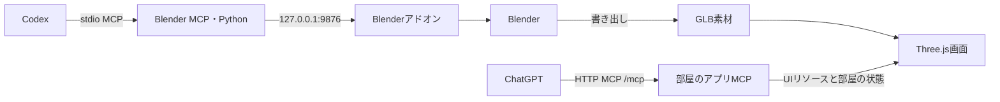

# 3D制作の開発環境

この段階では、Blender MCPで素材を制作できる環境とThree.jsの依存関係を用意します。部屋の3D表示・家具・新キャラの画面への組み込みは次の実装です。現在のアプリは2D版のままです。

## 技術スタック

| 用途 | 採用するもの | 役割 |
| --- | --- | --- |
| 開発・サーバー | Node.js 24、TypeScript、Express、esbuild | アプリのビルドとHTTP MCPサーバー |
| 画面の3D描画 | Three.js 0.185.1、@types/three 0.185.0 | GLBの読み込み、カメラ、光、家具の選択 |
| ChatGPTとの通信 | MCP SDK 1.31.0、MCP Apps SDK 1.7.5、OpenAI MCP Extensions 0.1.0 | ツール、UIリソース、ホストと画面の連携 |
| 3D素材制作 | Blender 5.2.2 LTS | 部屋や家具を作り、GLBへ書き出す |
| Codexから制作を操作 | mcp-for-blender 2.1.3 | Blenderのシーン取得、Python操作、書き出し |
| Blender MCPの実行 | uv/uvx、管理されたPython 3.11 | Blender自身のPythonとは別のMCPサーバープロセス |
| 画像素材 | 透過PNG、デザイン資料PNG | だらぱん・もちぱんの姿と部屋の方向性 |
| 品質確認 | 型検査、ビルド、Nodeテスト、GitHub Actions | 既存アプリの検証と開発環境の接続試験 |

Nodeの推奨系統は`.nvmrc`、アプリの依存関係は`package-lock.json`で管理します。Blender MCPは起動スクリプトでパッケージのバージョンを固定します。uvxで解決されるPython依存パッケージ全体の固定はまだ行っていません。

## 2種類のMCPを分ける



**Blender MCPは開発用**です。AIが制作中のBlenderを操作します。利用者にBlenderをインストールしてもらう必要はありません。

**アプリMCPは製品用**です。ChatGPTが「部屋を開く」「キャラを動かす」などのツールを呼び、画面に状態を渡します。ローカルでは`http://127.0.0.1:3000/mcp`です。ChatGPTから接続するための公開URL・認証・ホスティングは別途用意します。

OpenAIの公式[Bits & Boltsサンプル](https://github.com/openai/mcp-extensions/tree/main/plugins/bits-and-bolts)のBlender→GLB→Three.jsという制作・描画の流れを参考にします。Blender MCPは[コミュニティ製ツール](https://github.com/ahujasid/mcp-for-blender)で、OpenAI公式SDKとは別のものです。ツクヨミの内部実装が同じかは確認できていません。

## 初回準備

Node.js 24と[uv](https://docs.astral.sh/uv/getting-started/installation/)を用意し、リポジトリのルートで実行します。

```sh
npm ci
npm run setup:blender
```

macOS / Apple SiliconではBlenderの公式ミラーから5.2.2を取得し、公式チェックサムと照合して`.local/blender/Blender.app`へコピーします。`/Applications`へのインストールは行いません。ダウンロードは約330MiB、展開・Python環境を含め数GBの空き容量を用意してください。

ほかのOSや、既存のBlenderを使う場合は5.2.2の実行ファイルを指定します。

```sh
BLENDER_BIN=/absolute/path/to/blender npm run setup:blender
BLENDER_BIN=/absolute/path/to/blender npm run dev:blender
```

自動セットアップと実機検証の対象はmacOS arm64です。ほかのOSは未検証です。uvxがPATHにない場合は`UVX_BIN=/absolute/path/to/uvx`を指定できます。

`.local/`にはアプリ本体、Python、uvキャッシュ、アドオン、Blender設定、検証出力を置きます。これらはGitに含めません。保存すべき制作素材は`assets/`へ移します。

## Blenderを起動する

```sh
npm run dev:blender
```

専用のBlender設定で起動し、同じバージョンのパッケージに同梱されたアドオンを有効にして、`127.0.0.1:9876`で接続を待ちます。初回のQuick Setupは好みの言語や操作設定を選んでContinueで進めてください。

起動時のスクリプトがアドオンの有効化と接続設定を行います。通常のDockアイコンから起動したBlenderとは設定フォルダが異なるため、このプロジェクトでは上記コマンドを使います。二重起動すると9876番ポートが競合します。

終了はBlenderの通常の終了操作です。制作中の`.blend`は保存してください。確認用スクリプトは制作ファイルを保存・上書きしません。

## Codexに接続する

リポジトリのルートで実行します。シェルがルートの絶対パスを展開するので、GUI版Codexでも起動スクリプトを見つけられます。

```sh
codex mcp add darapan-blender -- "$PWD/scripts/blender-mcp.sh"
codex mcp get darapan-blender
```

この登録はCodexのユーザー設定に追加され、ほかのMCPサーバーの設定は保持されます。`darapan-blender`が既にある場合は現在の内容を確認してから変更してください。リポジトリを移動した場合は起動スクリプトの登録パスも更新します。

登録後はCodexを再起動してツール一覧に反映します。Blenderも起動した状態で利用します。設定の場所とSTDIO接続は[OpenAIのMCPドキュメント](https://learn.chatgpt.com/docs/extend/mcp)を参照してください。

実際の設定値は`scripts/dev-environment.sh`にまとまっています。

| 設定 | 値・目的 |
| --- | --- |
| BLENDER_HOST / BLENDER_PORT | `127.0.0.1` / `9876`。同じPC上で接続 |
| BLENDER_USER_CONFIG / BLENDER_USER_SCRIPTS | `.local/blender-user/`内。既存のBlender設定と分離 |
| BLENDERMCP_ADDONS_DIR | 専用scripts/addons。セットアップ時のコピー先 |
| UV_CACHE_DIR / UV_TOOL_DIR / UV_PYTHON_INSTALL_DIR | `.local/`内。GUI起動でも同じ実行環境を使う |
| UV_PYTHON_PREFERENCE | `only-managed`。システムPythonの変更を避ける |
| BLENDER_MCP_SAFE_MODE | `1`。MCP経由のPythonコードに制限を適用。通常のbpy操作とGLB書き出しは許可 |
| DISABLE_TELEMETRY / アドオンのtelemetry_consent | `true` / `false`。プロンプト・画像等のテレメトリーを無効化 |
| BLENDERMCP_NO_UPDATE_CHECK | `1`。アドオン更新を自動で確認せず、バージョン変更は明示的に行う |
| BLENDER_MCP_APPS / BLENDER_MCP_OPENAI_FORMS | `0`。まず標準MCPツールで接続。専用ビューポート拡張は後で検討 |

通常のMCPサーバー起動はuvxのオフラインモードでインストール済みパッケージを使います。初回のセットアップではネットワークで取得します。キャッシュを消した場合は`npm run setup:blender`を再実行してください。

safe modeはBlender全体を隔離するものではありません。`bpy`の書き出し等は許可され、同じPCのプロセスからアドオンのソケットに接続できます。制作専用のローカル接続として使います。

## 確認する

Blenderを起動した状態で、別のターミナルから実行します。

```sh
npm run check:blender
npm run check
```

`check:blender`は公式MCP SDKでSTDIOサーバーに接続し、ツール一覧・アドオンの互換性・シーン取得を確認します。確認用の一時メッシュをGLBへ書き出し、Three.jsのGLTFLoaderで読み込みます。一時メッシュは削除し、元の選択とアクティブオブジェクトを戻します。**Object Modeの専用制作シーンで実行**してください。

出力は`.local/verification/environment-check.glb`と`report.json`です。検証用モデルは部屋や家具の完成素材ではありません。

`npm run check`はBlenderなしでも実行でき、型検査・ビルド・8件のアプリテストを確認します。CIはNode.js 24でこのチェックを実行します。

## 次の実装で扱うこと

- Blenderで床・壁・家具を制作し、編集元の`.blend`と配布用の`.glb`を保存する。
- Three.jsで部屋を描き、透過PNGのだらぱん・もちぱんを板状のオブジェクトとして配置する。キャラの完全な3D化は別の制作工程。
- 2キャラの大きさは採用した部屋イメージに合わせる。初回サンプルの約半分という意図を配置スケールで表す。
- 画像・GLBの配信方法とCSPを設計する。現行UIは画像等をHTMLに内包するため、GLBの読み込みをそのまま追加するだけでは対応しない。
- ChatGPT実ホストで表示・ツール操作を確認する。ローカルMCP接続試験だけでは実ホストの動作確認は完了しない。

保存した資料と生成素材は[素材一覧](../assets/README.md)、この環境の検証結果は[検証記録](development-environment-verification.md)を参照してください。
